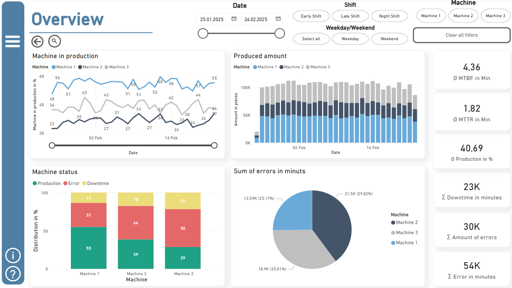
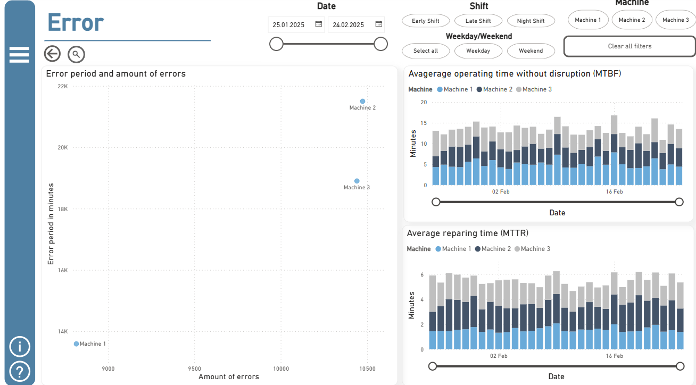
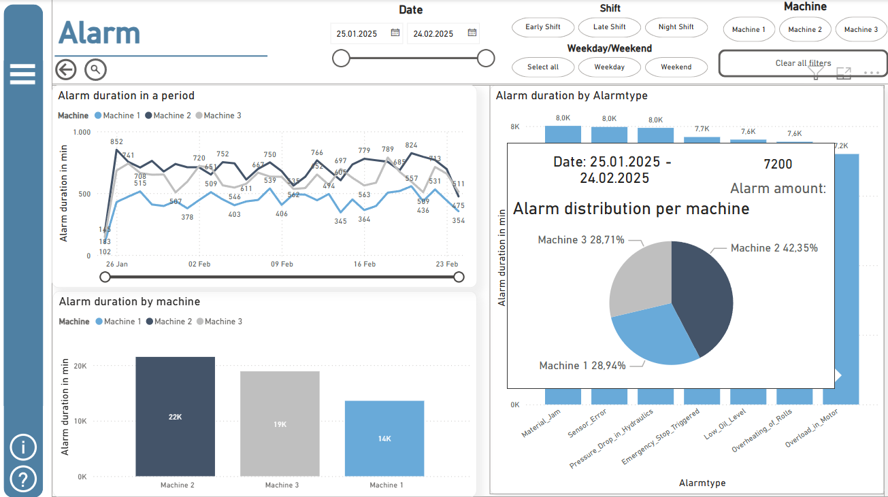
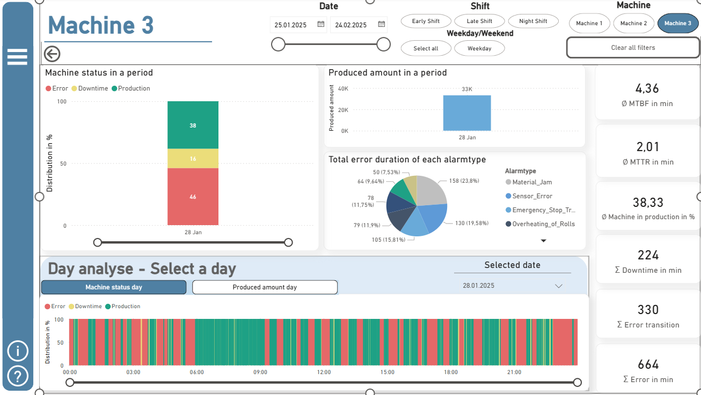

# 📌 Production Line Simulation with Python & Power BI

## 📖 Project Overview
This project simulates real-time production data for a manufacturing environment. Using Python, we generate machine data for a **30-day period**, capturing **productivity levels, alarms, and shift-based variations**. The generated data is then visualized in **Power BI**, providing meaningful insights into machine performance and efficiency.

## ⚙️ Key Features
✅ **Simulated Production Data** – Three machines operating 24/7, each with unique productivity levels  
✅ **Shift-Based Productivity** – Different shifts impact machine efficiency  
✅ **Alarm System** – Various machine alarms included to reflect realistic production conditions  
✅ **Minute-by-Minute Data Collection** – High-resolution data for accurate analysis  
✅ **Interactive Power BI Dashboard** – Visual representation of machine performance  

---

## 📂 Project Structure

```
📁 Production-Line-Simulation
│── 📄 README.md   # Project documentation  
│── 📄 Python_Code_Simulation.py   # Python script generating production data (Same code implemented in PowerBI_Report.pbix)
│── 📄 DAX-Code_PowerBI_SimulationPlant.DAX   # DAX script description used in PowerBI_Report.pbix
│── 📄 df_alarm-example.csv   # Sample dataset output of Python_Code_Simulation.py
│── 📄 df_mde-example.csv   # Sample dataset output of Python_Code_Simulation.py
│── 📊 PowerBI_Report.pbix   # Power BI report visualizing the data
```

---

## 📌 How It Works
1️⃣ Download Power BI and open the `PowerBI_Report.pbix` file.  
2️⃣ Use the Power BI file as needed.  
3️⃣ To update the data, click on the **update button**. (You need Python 3 and NumPy for the updating process and link Python with Power BI.)  

---

## 🔧 Technologies Used
- **Python** – Data generation & simulation  
- **Pandas & NumPy** – Data processing  
- **Power BI** – Data visualization & analytics  
- **Matplotlib (Optional)** – Exploratory data analysis  

---

## 📊 Power BI Dashboard Preview
The Power BI report consists of **four dashboards**, each focusing on a different aspect of machine performance. These dashboards provide insights into **production efficiency, machine errors, alarms, and detailed machine analysis**.

Each dashboard includes **interactive filters in the header**, allowing users to filter data by:
- **Date Range** (Calendar selection)
- **Shift Type** (Early Shift, Late Shift, Night Shift)
- **Machine Selection** (Machine 1, Machine 2, Machine 3)
- **Weekday/Weekend Toggle**
- **Clear All Filters Button**

### 🔍 Drill-Down Feature
- Clicking on a **machine activates the drill-down mode** (🔍 icon turns **green**).
- The user can then navigate to the **"Detail" page** to analyze that specific machine in more depth.

A **side navigation menu** (☰ icon) provides quick access to all dashboards, while an **Info page** (ℹ️ info button) offers additional details on how to interpret the visualizations.  
Some visuals include **detailed tooltips (Quick-Info)** to provide additional context when hovering over specific data points.

---

### **📌 Overview Dashboard**
**Purpose:** Provides a high-level summary of all three machines, including **production output, machine states, and errors**.

**Key Features:**
✅ **Production Trends:** Line chart showing the production percentage and the amount per machine  
✅ **Machine Status:** Stacked bar chart displaying **Production, Errors, and Downtime** per machine  
✅ **Error Distribution:** Pie chart summarizing **error durations**  
✅ **KPIs:** Key performance indicators (**MTBF, MTTR, production efficiency**) as numeric cards  

📌 **Users can apply filters** to focus on specific machines, shifts, or time periods by clicking on specific categories in charts or using the filters in the header.


---

### **📌 Error Dashboard**
**Purpose:** Focuses on **machine errors**, highlighting **frequency, duration, and trends**.

**Key Features:**
✅ **Error Trend Analysis:** Scatter plot showing **error count vs. duration**  
✅ **MTBF & MTTR:** Bar charts tracking **Mean Time Between Failures (MTBF)** and **Mean Time To Repair (MTTR)** per machine  
✅ **Error Filtering:** Users can filter by **machine, shift, and time range** for detailed analysis  


---

### **📌 Alarm Dashboard**
**Purpose:** Analyzes **machine alarms**, helping to identify **recurring issues and potential failures**.

**Key Features:**
✅ **Alarm Frequency Analysis:** Line chart displaying **alarm occurrences over time**  
✅ **Alarm Distribution by Alarm Type:** Bar chart showing the **proportion of different alarm types** (Quick Info provides details per machine)  
✅ **Error Duration by Machine:** Bar chart analyzing **alarm durations for each machine**  

📌 **Users can identify patterns and correlations** between alarms and production performance.


---

### **📌 Detail Dashboard (Drill-Down)**
**Purpose:** Provides an **in-depth analysis** of a single machine, activated through the **drill-down function**.

**Key Features:**
✅ **Machine-Specific Metrics:** Focuses on a **single machine's performance**  
✅ **Production & Errors Per Day:** Visual representation of **daily machine output and error occurrences**  
✅ **Day Analysis:** Users can **select a specific day** and analyze the machine's behavior in detail for machine status and production  
✅ **KPIs:** Detailed **machine efficiency indicators (MTBF, error transition, downtime)**  

📌 This page enables a **deeper understanding of machine performance** and potential optimizations.


---

## 📢 Contribution & Feedback
💡 **Many features haven't been described. Download it and try it out!**  
📬 **Have questions or suggestions?** Open an **issue** or reach out.

---

## 📜 License
This project is released under the **MIT License** – feel free to use and modify it.
